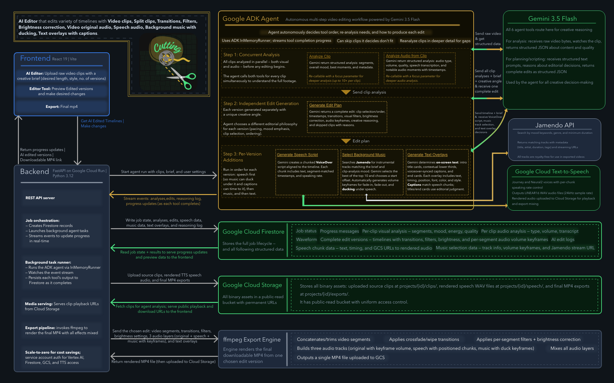

# Cutting

An autonomous AI video editing agent. Give it raw footage and a one-line creative
brief, and it analyzes the clips, makes editorial decisions, and produces multiple
finished edit proposals you can preview, compare, and export as MP4 -- complete with
transitions, filters, color correction, a mixed multi-layer soundtrack (original audio
plus AI voiceover and licensed music), and on-screen text.

Built for the All Things Agentic Hackathon. Category: **The Taskmaster**.

## The Problem

Video editing is slow, skill-gated work. Turning a folder of raw clips into a polished
cut means manually reviewing footage, choosing the best moments, sequencing them,
adding transitions and color, scripting and recording voiceover, sourcing music,
mixing audio levels, and timing captions. Each step is a friction point.

Cutting removes that friction. It takes a single brief and runs the entire
production pipeline autonomously, then hands you finished proposals to choose from.
It is not a chatbot you converse with step by step -- it is an agent that plans and
executes a multi-step editorial workflow on its own.

## How the Agent Removes Friction (The Taskmaster)

From one brief, the agent independently:

1. Analyzes every clip for visual content, mood, energy, quality, and key moments.
2. Analyzes every clip's audio (type, quality, speech, ambience).
3. Re-analyzes clips to fill gaps when it decides it needs more detail.
4. Chooses distinct creative angles for each proposal.
5. Assembles timelines -- selecting, ordering, trimming, and intercutting segments,
   and skipping footage that does not fit.
6. Applies transitions, filters, brightness correction, and speed adjustments.
7. Scripts and generates AI voiceover (when enabled).
8. Selects licensed background music and auto-ducks it under speech (when enabled).
9. Generates titles, lower thirds, captions, and end cards (when enabled).

You review the results in an editor-style UI, tweak, and export.

## Features

- Autonomous multi-proposal edit generation from a single brief
- Per-clip video and audio analysis (with agent-driven re-analysis)
- Timeline assembly with segment selection, ordering, trimming, and intercutting
- Transitions, filters, brightness correction, and video speed/motion handling
- Mood presets and variation preferences (pacing, ordering, clip selection, emphasis)
- Three-layer audio: original clip audio + AI voiceover (Google Cloud TTS) + music
  (Jamendo), with volume keyframes and automatic ducking of music under speech
- Text overlays: titles, lower thirds, speech-timed captions, and end cards, burned
  into the export
- AI edit log showing the agent's reasoning and decisions
- MP4 export with all effects and mixed audio (ffmpeg)
- Persistent projects (Google Cloud Storage + Firestore)
- Landing page with showcase projects

## Tech Stack

| Layer | Technology |
|-------|-----------|
| Frontend | React 19 + Vite + TypeScript, Tailwind CSS, React Router |
| Backend | FastAPI (Python 3.12) |
| Agent framework | Google Agent Development Kit (ADK) |
| AI model | Gemini 3.5 Flash via Vertex AI (global endpoint) |
| Speech | Google Cloud Text-to-Speech |
| Music | Jamendo API (licensed tracks) |
| Database | Firestore (job and project state) |
| Storage | Google Cloud Storage (clips, audio, text, exports) |
| Media processing | ffmpeg |
| Hosting | Cloud Run (backend) |

## Architecture



At a high level: the React frontend talks to a FastAPI backend on Cloud Run over REST.
The backend orchestrates a Google ADK agent that reasons with Gemini 3.5 Flash (Vertex
AI, global endpoint) and calls its tools -- analyze video, analyze audio, generate edit
plan, generate speech, select music, and generate text overlays. The backend also
integrates Google Cloud Text-to-Speech for voiceover and the Jamendo API for music.
Job and project state lives in Firestore; all media (source clips, generated audio,
text, and MP4 exports) lives in Google Cloud Storage.

## Google Cloud Services Used

- **Vertex AI** -- hosts Gemini 3.5 Flash (via the `global` endpoint), used for all
  analysis and creative reasoning.
- **Google ADK** -- the agent framework orchestrating the multi-step workflow.
- **Cloud Text-to-Speech** -- generates voiceover audio.
- **Firestore** -- stores job status, clip analyses, proposals, and project records.
- **Cloud Storage (GCS)** -- stores uploaded clips, generated audio/text, and exports.
- **Cloud Run** -- serverless hosting for the backend.

## Repository Layout

```
backend/            FastAPI app, ADK agent, services, Dockerfile
  app/
    agent/          Agent definition + tools (analyze, plan, speech, music, text)
    routers/        API endpoints (jobs, clips, projects, exports, speech, music, generate)
    services/       Firestore, GCS, TTS, exporter, waveform, etc.
frontend/           React + Vite app (editor UI, timeline, playback, landing page)
assets/             Architecture diagram
```

## Test an Edit

Try the app end-to-end with a ready-made example:

1. Click **Create New Project** and open the edit form.
2. In the Media Bin, switch to **Library** and select the 5 historic landmark
   clips: `historic-1.mp4`, `historic-2.mp4`, `historic-3.mp4`, `historic-4.mp4`,
   `historic-5.mp4`.
3. Set the brief and settings below, then click **Generate**.

**Mood Preset:** Custom

**Brief:**
> A cinematic showcase of historic world landmarks with on-screen titles naming each place

**Settings:**

| Setting | Value |
|---------|-------|
| Duration | min 25s, max 40s |
| Proposals | 2 |
| Add Transitions | ON |
| Allow Filters | ON (subtle cinematic grade) |
| Auto Brightness | ON (real footage, varied exposure) |
| Manage Original Audio | ON |
| Add Background Music | ON (orchestral / epic score) |
| Add Voiceover | ON |
| Add Captions | OFF |
| Add Titles | ON (title cards + lower thirds naming each landmark) |

**Speech Notes:**
> Say at the beginning: "Welcome to the history."

## Setup

### Prerequisites

- Python 3.12+
- Node.js 20+
- ffmpeg (installed locally for exports; already included in the backend Docker image)
- A Google Cloud project with billing enabled and these APIs enabled:
  Vertex AI, Cloud Text-to-Speech, Firestore, Cloud Storage, Cloud Run
- A service account key (JSON) with roles for Vertex AI, Firestore, GCS, and TTS
- A Jamendo API client ID (free developer account)

### Environment Variables

Create `backend/.env` (do not commit it):

```
GOOGLE_APPLICATION_CREDENTIALS=service-account.json
GOOGLE_CLOUD_PROJECT=your-gcp-project-id
GOOGLE_CLOUD_LOCATION=global
GCS_BUCKET_NAME=your-gcs-bucket-name
JAMENDO_CLIENT_ID=your-jamendo-client-id
```

Notes:
- `GOOGLE_CLOUD_LOCATION` must be `global` -- Gemini 3.5 Flash is served on the global
  Vertex AI endpoint.
- Place the service account JSON at `backend/service-account.json` (or point
  `GOOGLE_APPLICATION_CREDENTIALS` at wherever it lives).

For the frontend, set the backend URL (optional locally; defaults to
`http://localhost:8080`). Create `frontend/.env`:

```
VITE_API_URL=http://localhost:8080
```

### Backend

```
cd backend
python -m venv venv
source venv/bin/activate        # Windows: venv\Scripts\activate
pip install -r requirements.txt
uvicorn app.main:app --host 0.0.0.0 --port 8080 --reload
```

The API serves at `http://localhost:8080`. Health check: `GET /health`.

### Frontend

```
cd frontend
npm install
npm run dev
```

Vite serves the app (default `http://localhost:5173`), pointed at the backend via
`VITE_API_URL`.

## Deploying to Cloud Run

```
gcloud run deploy cutting \
  --source backend \
  --region us-central1 \
  --memory 2Gi \
  --cpu 2 \
  --min-instances 0 \
  --max-instances 3 \
  --set-env-vars GOOGLE_CLOUD_PROJECT=your-project-id,GOOGLE_CLOUD_LOCATION=global,GCS_BUCKET_NAME=your-bucket,JAMENDO_CLIENT_ID=your-jamendo-id \
  --service-account your-sa@your-project-id.iam.gserviceaccount.com \
  --allow-unauthenticated
```

For the frontend, build with the deployed backend URL and host the output:

```
cd frontend
VITE_API_URL=https://your-backend.run.app npm run build
```
